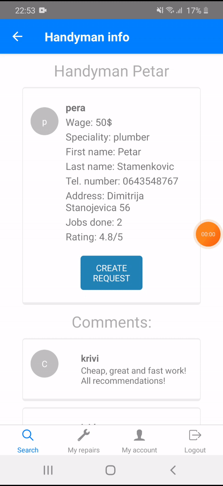

# Handyman Booking (Android app)

## Introduction
This repository contains React Native mobile app (Android) for searching and booking handymen/repairmen.

The whole Handyman booking system has desktop application and mobile app. Users can search through the the list of all available handymen on the system, book the job and  handymen can manage their bookings and accept/decline the job requests.
From desktop application users can only browse through the available hadnymen and book the job with them. 

Described android application is implemented in [React Native](https://reactnative.dev/). Realtime database from [Firebase](https://firebase.google.com/) was used.

This implementation was done as project work on the course [User Interface Design](https://www.etf.bg.ac.rs/en/fis/karton_predmeta/13M111PKI-2013#gsc.tab=0) on Master's degree in Software Engineering.

## Android app demo

### Booking a handyman
1. Users can search for the desired handyman on this system. In order to book the handyman for the certain job, they must first create an account and only  then they can book the job and manage their booking requests. 

    

2. After logging in to the app, they would be able to book the job with the selected handyman, by providing all necessary information and other details related to the job request.

    

### Managing bookings
Once the handyman has created an account with all necessary info, users would be able to find him on the platform. Handyman can use this app to accept or decline job requests and to manage all of his job requests. 

    

